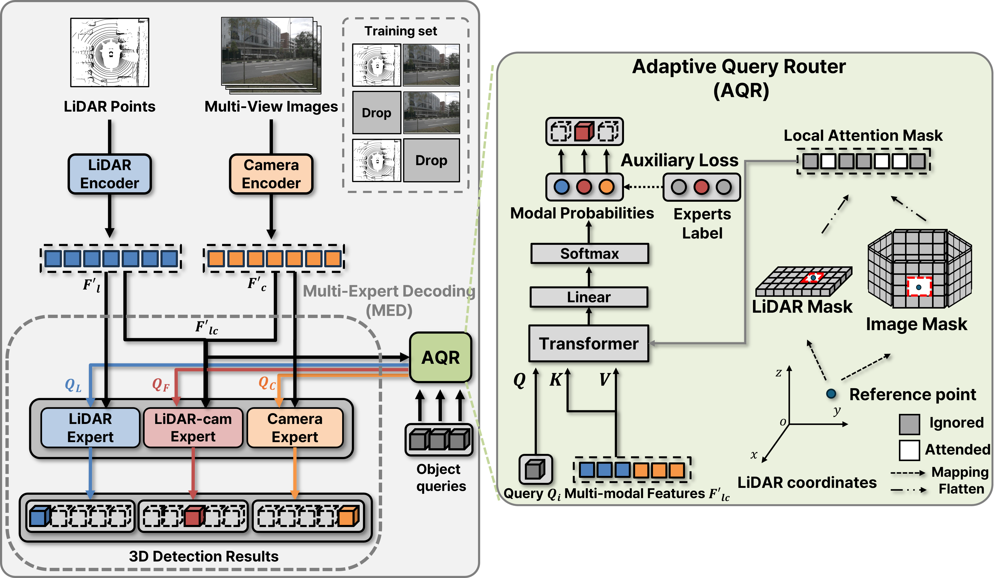

<div align="center">
<h1>[CVPR2025] MoME </h1>
<h3>Resilient Sensor Fusion under Adverse Sensor Failures via Multi-Modal Expert Fusion</h3>

Konyul Park<sup>1</sup> \*, Yecheol Kim<sup>2,3</sup> \*, Daehun Kim<sup>2</sup>, Jun Won Choi<sup>1</sup> \**
 
<sup>1</sup> Seoul National University, Korea <sup>2</sup> Hanyang University, Korea, <sup>3</sup> LG AI Research, Korea

(\*) equal contribution, (\**) corresponding author.

ArXiv Preprint ([arXiv 2407.13517](https://arxiv.org/abs/2503.19776))
</div>



## Introduction
In this study, we introduce an efficient and robust LiDAR-camera 3D object detector, referred to as MoME, which can achieve robust performance through a mixture of experts approach. Our MoME fully decouples modality dependencies using three parallel expert decoders, which use camera features, LiDAR features, or a combination of both to decode object queries, respectively. We propose Multi-Expert Decoding (MED) framework, where each query is decoded selectively using one of three expert decoders. MoME utilizes an Adaptive Query Router (AQR) to select the most appropriate expert decoder for each query based on the quality of camera and LiDAR features. This ensures that each query is processed by the best-suited expert, resulting in robust performance across diverse sensor failure scenarios. We evaluated the performance of MoME on the nuScenes-R benchmark. Our MoME achieved state-of-the-art performance in extreme weather and sensor failure conditions, significantly outperforming the existing models across various sensor failure scenarios.

## Qualitative results (NDS) on nuScenes and nuScenes-R dataset 


|Method|Training Schedule|Clean|Beam Reduction|LiDAR Drop|Limited FOV|Object Failure|View Drop|Occlusion| config | weight |
|:----|:----|:----|:----|:----|:----|:----|:----|:----|:----|:----|
| | | | 4 beams | all | ±60 | 0.5 | all |  |  |  |
| MoME | 2 Epochs | 73.6 | 63.0 | 48.2 | 58.3 | 71.0 | 69.5 | 70.5 | [config](https://github.com/konyul/MoME/blob/main/projects/configs/mome/mome.py) | [weight](https://drive.google.com/file/d/1dFwy-eUrTMVJkoufT58rwvqis5lfOoEH/view?usp=sharing) |

## Notes
We Evaluate MoME on [nuScenes-R](https://github.com/ADLab-AutoDrive/lidar-camera-robust-benchmark) and [nuScenes-C](https://github.com/thu-ml/3D_Corruptions_AD)

## Getting Started
- [Installation](docs/install.md)
- [Prepare Dataset](docs/prepare_dataset.md)
- [Train and Eval](docs/train_eval.md)

## Acknowledgements

MoME is based on [MEFormer](https://github.com/hanchaa/MEFormer). It is also greatly inspired by the following outstanding contributions to the open-source community: [mmdetection3d](https://github.com/open-mmlab/mmdetection3d), [CMT](https://github.com/junjie18/CMT).

## Citation
If you find MoME is useful in your research or applications, please consider giving us a star 🌟 and citing it by the following BibTeX entry.
```bibtex
@misc{MoME,
      title={Resilient Sensor Fusion under Adverse Sensor Failures via Multi-Modal Expert Fusion}, 
      author={Konyul Park and Yecheol Kim and Daehun Kim and Jun Won Choi},
      year={2025}
}
```
